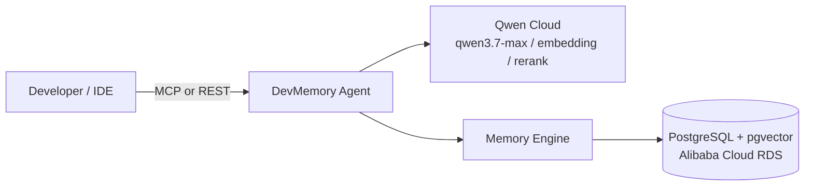

# DevMemory Agent

An AI coding assistant with persistent memory across developer sessions — built on Qwen Cloud and deployed on Alibaba Cloud.

## Hackathon

**QwenCloud Global AI Hackathon** — Track 1: MemoryAgent

DevMemory remembers what you've told it across sessions — your tool preferences, the decisions you've made, the bugs you've fixed — and uses that memory to give better, less repetitive answers over time, without you ever having to ask it to "remember."

## Demo

🎥 _Demo video link — to be added before submission (max 3 minutes, YouTube/Vimeo/Youku)._

## Architecture

Full system diagrams (request flow + memory lifecycle): [docs/architecture.md](docs/architecture.md)



## How It Works

1. **Retrieve** — every message is embedded and matched against stored memories via pgvector cosine similarity (top 20 candidates).
2. **Rerank** — candidates are reordered by `qwen3-rerank` for true semantic relevance, with decay applied so stale memories rank lower even if textually similar.
3. **Fit** — the highest-value memories are greedily packed into an 8,000-token context budget and injected into the system prompt.
4. **Respond** — `qwen3.7-max` answers using that context, with 4 custom tools (skills) it can call directly to recall, save, or search memory mid-conversation.
5. **Remember** — after every turn, an extraction pass autonomously pulls out new preferences, decisions, bug fixes, and patterns — no explicit "remember this" required — and reinforces whichever memories were actually used.

## Quick Start

```bash
cp .env.example .env
# fill in QWEN_API_KEY at minimum (see "Getting a Qwen Cloud API key" below)

docker-compose up --build
```

This starts 4 services: `db` (PostgreSQL 16 + pgvector), `redis`, `backend` (FastAPI on :8000), and `mcp` (MCP server on :8001).

Verify it's up:

```bash
curl http://localhost:8000/health
# {"status":"ok","db":"connected","qwen":"reachable"}
```

### Getting a Qwen Cloud API key

Sign up at [qwencloud.com](https://qwencloud.com) and use the free quota, or request the hackathon's $40 Qwen Cloud voucher if you're not eligible for the free trial.

## API Reference

| Method | Endpoint | Description |
|---|---|---|
| `GET` | `/health` | Pings DB and Qwen Cloud; returns `503` if the DB is unreachable |
| `POST` | `/api/v1/chat` | Send a message, get a memory-augmented response |
| `GET` | `/api/v1/memories/{user_id}` | List a user's memories (optional `?project_id=`) |
| `DELETE` | `/api/v1/memories/{user_id}/{memory_id}` | Delete a specific memory |
| `POST` | `/api/v1/memories/{user_id}/forget` | Run Ebbinghaus decay, auto-forget memories below the importance threshold |
| `GET` | `/api/v1/memories/{user_id}/stats` | Memory stats: totals, breakdown by type, at-risk count |

## MCP Tools

DevMemory also runs as an MCP server (`app/mcp/server.py`, port 8001) so any MCP-compatible IDE or agent can use it directly:

| Tool | Description |
|---|---|
| `memory_save` | Save a memory to the persistent store |
| `memory_search` | Two-stage semantic search (embedding + rerank) |
| `memory_forget` | Forget a specific memory by ID, or run decay-based auto-forgetting |
| `memory_stats` | Memory statistics for a user: totals, by-type breakdown, at-risk memories |

## Memory Decay Algorithm

Importance follows an Ebbinghaus-style forgetting curve, adapted with an access-count retention bonus:

```
effective_decay = max(0, decay_rate - log1p(access_count) * 0.1)
importance(t)   = base_importance * e^(-effective_decay * days_since_access)
```

Each memory type decays at a different rate — preferences and patterns are built to outlast bug fixes:

| Type | Decay rate |
|---|---|
| `preference` | 0.02 (slowest) |
| `pattern` | 0.03 |
| `decision` | 0.05 |
| `bug_fix` | 0.08 |
| `general` | 0.10 (fastest) |

Recalling a memory boosts its importance by +0.2 (capped at 1.0) — frequently-used memories actively resist decay. Memories whose current importance drops below `MEMORY_IMPORTANCE_THRESHOLD` (default 0.05) are auto-forgotten.

## Tech Stack

| Layer | Technology |
|---|---|
| Language | Python 3.11 |
| API Framework | FastAPI |
| Database | PostgreSQL 16 + pgvector (Alibaba Cloud RDS) |
| AI — Reasoning | Qwen Cloud `qwen3.7-max` |
| AI — Embedding | Qwen Cloud `text-embedding-v4` |
| AI — Reranking | Qwen Cloud `qwen3-rerank` |
| MCP Protocol | `mcp` / `fastmcp` |
| Session Cache | Redis |
| DI | `dependency-injector` |
| Container | Docker + docker-compose |
| Cloud | Alibaba Cloud ECS + RDS PostgreSQL |

## Alibaba Cloud Deployment

Proof of Alibaba Cloud service usage (ECS + RDS + Qwen Cloud API, each verified independently): [alibaba_cloud_proof/alibaba_proof.py](alibaba_cloud_proof/alibaba_proof.py)

```bash
cd alibaba_cloud_proof && python alibaba_proof.py
```

## Scalability & Productization

DevMemory is architected for SaaS from day one:
- **Multi-tenant isolation** — every memory is scoped to `user_id` (+ optional `project_id`/`workspace_id` via `WorkspaceContext`)
- **Horizontal scaling** — stateless FastAPI + external Redis + managed Postgres
- **MCP protocol** — any IDE or AI tool connects without custom integration work
- **Repository pattern** — swap pgvector for another vector store with zero changes to `MemoryEngine` or the agent

## License

MIT — see [LICENSE](LICENSE)
