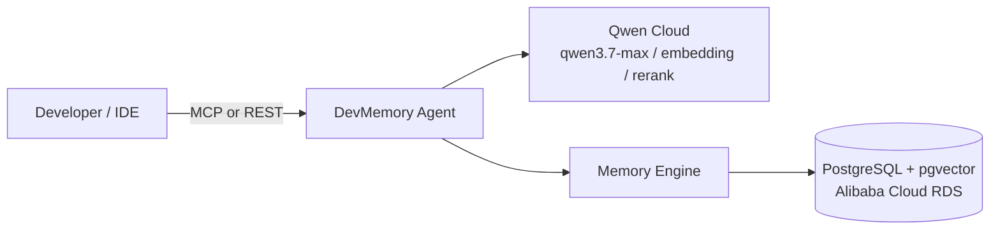

# DevMemory Agent

Most AI coding assistants forget everything the moment the session ends. DevMemory doesn't — it's an AI assistant built on Qwen Cloud and deployed on Alibaba Cloud that carries what it learns about you from one session into the next.

Tell it your tool preferences, the architectural decisions you make, the bugs you fix — it picks those up on its own, no explicit "remember this" needed. Every memory is embedded, semantically searched and reranked, and weighed against an Ebbinghaus-style decay curve, so the things you actually use stay sharp and the things you don't fade out — the same way a human collaborator's memory works.

## Demo

🎥 Watch the demo: https://youtu.be/4esHfUGIO48

## Architecture

Full system diagrams (request flow + memory lifecycle): [docs/architecture.md](docs/architecture.md)



## How It Works

1. **Retrieve** — every message is embedded and matched against stored memories via pgvector cosine similarity (top 20 candidates).
2. **Rerank** — candidates are reordered by `qwen3-rerank` for true semantic relevance, with decay applied so stale memories rank lower even if textually similar.
3. **Fit** — the highest-value memories are greedily packed into an 8,000-token context budget and injected into the system prompt.
4. **Respond** — `qwen3.7-max` answers using that context, with 4 custom tools (skills) it can call directly to recall, save, or search memory mid-conversation.
5. **Remember** — after the response is sent, a background extraction pass autonomously pulls new preferences, decisions, bug fixes, and patterns out of *your* message (never the assistant's own reply, to avoid re-saving facts it just recalled) — no explicit "remember this" required — and reinforces whichever memories were actually used. Near-duplicate extractions reinforce the existing memory instead of creating a new row.

## Quick Start

```bash
cp .env.example .env
# fill in QWEN_API_KEY at minimum (see "Getting a Qwen Cloud API key" below)

docker-compose up --build
```

This starts 5 services: `db` (PostgreSQL 16 + pgvector), `redis`, `backend` (FastAPI on :8000), `frontend` (demo UI on :3000), and `mcp` (MCP server on :8001).

Verify it's up:

```bash
curl http://localhost:8000/health
# {"status":"ok","db":"connected","qwen":"reachable"}
```

Then open [http://localhost:3000](http://localhost:3000) for the demo UI — enter a `user_id`, chat with the agent, and watch the memory panel populate and decay over time.

### Getting a Qwen Cloud API key

1. Sign up at [qwencloud.com](https://qwencloud.com) and check your free quota.
2. Generate an API key from your account dashboard.
3. Paste it into `.env`:

   ```env
   QWEN_API_KEY=sk-your-key-here
   ```

`QWEN_BASE_URL` and the model names (`qwen3.7-max`, `text-embedding-v4`, `qwen3-rerank`) already default to the right values in `.env.example` — no other changes needed to get running.

## Demo UI

A single-page Next.js app (`frontend/`) split into a chat pane and a live memory panel:

- **Chat** — markdown-rendered responses (headings, tables, code), with a "used N memories" tag whenever retrieval surfaced context for that turn.
- **Memory panel** — stats (total / avg importance / at-risk), a live decay chart (each memory's importance recalculated client-side with the same Ebbinghaus formula as the backend, so bars visibly shrink between visits), and a card list with one-click delete per memory.

Runs as its own docker-compose service on port 3000. For local dev without Docker: `cd frontend && npm install && npm run dev` (needs the backend running separately on `:8000`).

## API Reference

| Method | Endpoint | Description |
|---|---|---|
| `GET` | `/health` | Pings DB and Qwen Cloud; returns `503` if the DB is unreachable |
| `POST` | `/api/v1/chat` | Send a message, get a memory-augmented response |
| `GET` | `/api/v1/memories/{user_id}` | List a user's memories (optional `?project_id=`) |
| `DELETE` | `/api/v1/memories/{user_id}/{memory_id}` | Delete a specific memory |
| `POST` | `/api/v1/memories/{user_id}/forget` | Run Ebbinghaus decay, auto-forget memories below the importance threshold |
| `GET` | `/api/v1/memories/{user_id}/stats` | Memory stats: totals, breakdown by type, at-risk count |

## MCP Integration

DevMemory runs as an MCP server (`app/mcp/server.py`, port 8001), so Claude Code, Claude Desktop, or any MCP-compatible IDE can connect to it directly. Memories built up through the chat UI and memories saved from your IDE share the same Alibaba Cloud database — context follows you across tools.

**Connect to Claude Code:**

```bash
claude mcp add devmemory -- docker exec -i devmemory-mcp-1 python -m app.mcp.server
```

**Connect to Claude Desktop** — add to `claude_desktop_config.json`:

```json
{
  "mcpServers": {
    "devmemory": {
      "command": "docker",
      "args": ["exec", "-i", "devmemory-mcp-1", "python", "-m", "app.mcp.server"]
    }
  }
}
```

Once connected, the agent has access to four tools:

| Tool | Description |
|---|---|
| `memory_save` | Save a memory to the persistent store |
| `memory_search` | Two-stage semantic search (embedding + rerank) |
| `memory_forget` | Forget a specific memory by ID, or run decay-based auto-forgetting |
| `memory_stats` | Memory statistics for a user: totals, by-type breakdown, at-risk memories |

## Memory Decay Algorithm

Importance follows an Ebbinghaus-style forgetting curve, adapted with an access-count retention bonus:

```
effective_decay = max(0, decay_rate - log1p(access_count) * 0.1)
importance(t)   = base_importance * e^(-effective_decay * days_since_access)
```

Each memory type decays at a different rate — preferences and patterns are built to outlast bug fixes:

| Type | Decay rate |
|---|---|
| `preference` | 0.02 (slowest) |
| `pattern` | 0.03 |
| `decision` | 0.05 |
| `bug_fix` | 0.08 |
| `general` | 0.10 (fastest) |

Recalling a memory boosts its importance by +0.2 (capped at 1.0) — frequently-used memories actively resist decay. Memories whose current importance drops below `MEMORY_IMPORTANCE_THRESHOLD` (default 0.05) are auto-forgotten.

## Tech Stack

| Layer | Technology |
|---|---|
| Language | Python 3.11 |
| API Framework | FastAPI |
| Database | PostgreSQL 16 + pgvector (Alibaba Cloud RDS) |
| AI — Reasoning | Qwen Cloud `qwen3.7-max` |
| AI — Embedding | Qwen Cloud `text-embedding-v4` |
| AI — Reranking | Qwen Cloud `qwen3-rerank` |
| MCP Protocol | `mcp` / `fastmcp` |
| Session Cache | Redis |
| DI | `dependency-injector` |
| Frontend | Next.js 14 (App Router) + TypeScript + Tailwind + Recharts |
| Container | Docker + docker-compose |
| Cloud | Alibaba Cloud ECS + RDS PostgreSQL |

## Alibaba Cloud Deployment

Deployed end-to-end on Alibaba Cloud: backend + frontend + MCP server on an ECS instance (docker-compose), persistent memory storage on ApsaraDB RDS for PostgreSQL (pgvector enabled).

Proof of Alibaba Cloud service usage (ECS + RDS + Qwen Cloud API, each verified independently): [alibaba_cloud_proof/alibaba_proof.py](alibaba_cloud_proof/alibaba_proof.py).

```bash
cd alibaba_cloud_proof && python alibaba_proof.py
```

When deploying, set `NEXT_PUBLIC_API_URL` to the ECS instance's public IP/domain (e.g. `http://<ecs-ip>:8000`) before building the `frontend` image — it's baked into the browser bundle at build time, so the default `http://localhost:8000` only works for local docker-compose:

```bash
NEXT_PUBLIC_API_URL=http://<ecs-ip>:8000 docker-compose up --build
```

## Scalability & Productization

DevMemory is architected for SaaS from day one:
- **Multi-tenant isolation** — every memory is scoped to `user_id` (+ optional `project_id`/`workspace_id` via `WorkspaceContext`)
- **Horizontal scaling** — stateless FastAPI + external Redis + managed Postgres
- **MCP protocol** — any IDE or AI tool connects without custom integration work
- **Repository pattern** — swap pgvector for another vector store with zero changes to `MemoryEngine` or the agent

## License

MIT — see [LICENSE](LICENSE)
