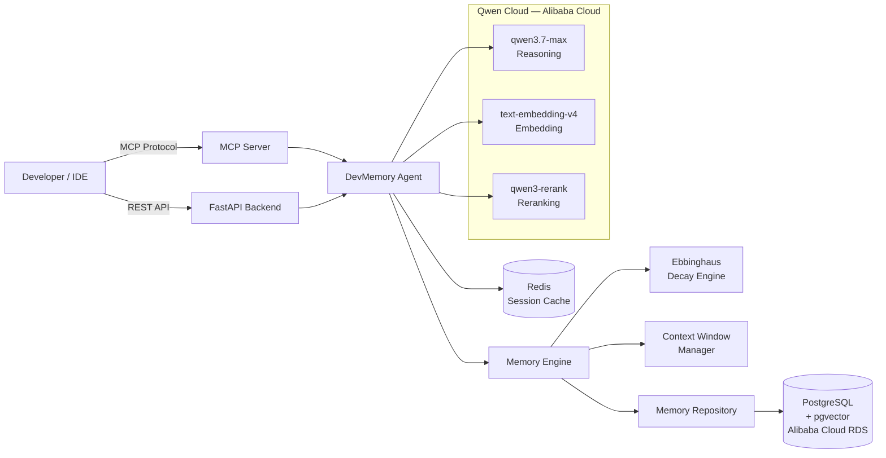
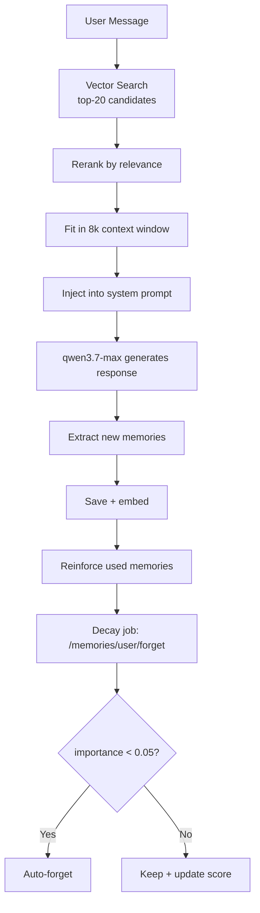

# DevMemory Agent — System Architecture

## Request Flow

## Memory Lifecycle

## Component Responsibilities

| Component | File | Responsibility |
|---|---|---|
| `DevMemoryAgent` | `app/agent/agent.py` | Full chat loop: retrieve → select → inject → call Qwen with tools → dispatch tool calls → extract → save → reinforce |
| `MemoryEngine` | `app/core/memory_engine.py` | Orchestrates two-stage retrieval (vector + rerank), decay-aware scoring, save/forget/reinforce |
| `MemoryRepository` | `app/db/repositories/memory_repository.py` | All raw SQL — pgvector cosine search, CRUD, stats. No SQL leaks above this layer |
| `DecayEngine` | `app/core/decay.py` | Ebbinghaus forgetting curve with access-count retention bonus, per-type decay rates |
| `EmbeddingService` | `app/core/embedding.py` | `text-embedding-v4` embeddings + `qwen3-rerank` reranking, with graceful fallback |
| `ContextWindowManager` | `app/core/context_manager.py` | Greedy token-budget selection for the 8k memory context window |
| `MemoryExtractor` | `app/agent/extractor.py` | Autonomous LLM-based memory extraction from each conversation turn |
| `Container` | `app/container.py` | dependency-injector wiring for every service above |
| MCP Server | `app/mcp/server.py` | 4 tools (`memory_save`, `memory_search`, `memory_forget`, `memory_stats`) for any MCP-compatible IDE/agent |
